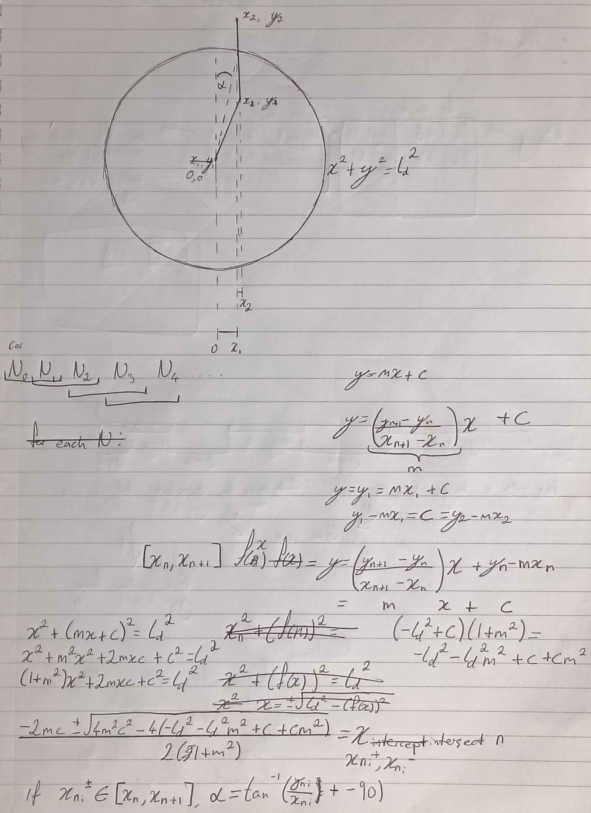

# NRAI CONTROLLER
## Requirements

 - Any Linux system, or WSL when ran on Windows
	 - If using WSL, make sure any other modules ran simultaneously are executed in the same subsystem, or they will be unable to communicate.
 - Python 3.x

## Installation
The NRAI controller is a component of the larger [NRAI Fullstack project](https://github.com/NewcastleRacingAI/nrai_perception/tree/nrai_perception_fullstack). Installation and usage can be achieved by way of the `setup` and `boot` scripts, respectively. NRAI Fullstack takes care of this via a nested setup and boot structure, but execution of these scripts standalone is valid and useful for unit testing.

## Operation and Structure
The NRAI controller operates between two libraries, the ros_node.py file, which is serves as the main process, and the purepursuit.py file, which the ros_node.py file which hosts the pure pursuit algorithm.

The NRAI Controller receives path information (list of tuples (X, Z)) via the named pipe at `/tmp/PATHPLANNING_Path`, and propagates instructions forwards via the named pipe at `/tmp/lower_ctrl_cmd` in the schema defined [here](https://github.com/NewcastleRacingAI/nrai-NIMS/blob/main/modules/lower-controller/controller_com_spec).

## Pure pursuit
Pure pursuit is a simple control algorithm which uses the bicycle model of locomotion, which reduces a four wheeled vehicle to a two wheeled bicycle abstraction. Below is our derivation of the key parameter α in the pure pursuit algorithm found [here](https://thomasfermi.github.io/Algorithms-for-Automated-Driving/Control/PurePursuit.html), which altogether forms the basis for the implementation of pure pursuit as seen in purepursuit.py:

